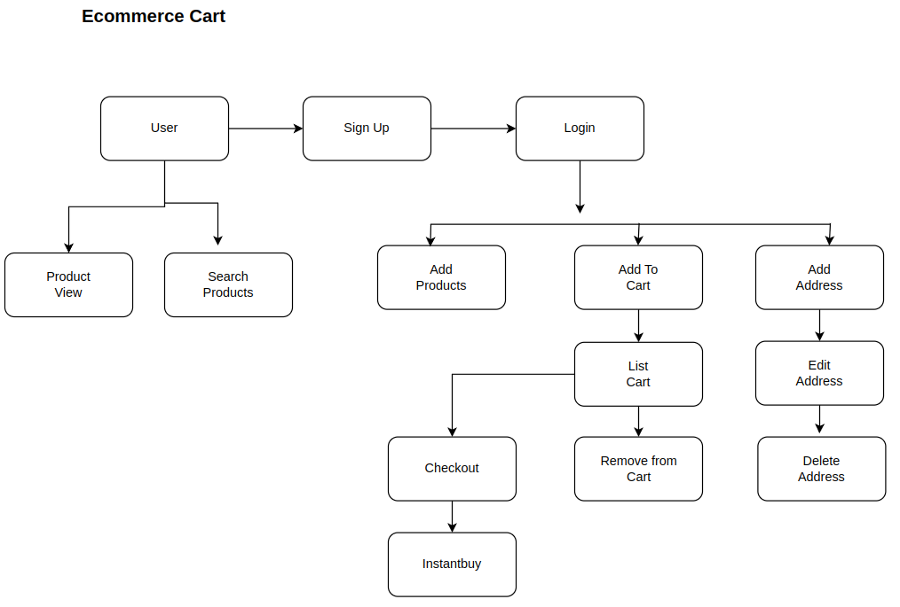

### Practice building end-to-end E-Commerce site

# Ecommerce Backend Project in Go

Welcome to the Ecommerce Backend Project! This project is designed to help you learn Go programming language by building a backend system for an ecommerce platform.

## Project Overview

The project consists of various functionalities to manage an ecommerce platform's backend operations. Here's a brief overview of the functionalities:

- **User Management**: Sign up, login, and manage user accounts.
- **Product Management**: Add, view, and search products.
- **Cart Management**: Add products to cart, list cart items, remove items from the cart.
- **Checkout**: Process orders, handle payments, and manage the checkout process.
- **Address Management**: Add, remove, and edit user addresses.
- **Instant Buy**: Directly purchase products without adding them to the cart.

## Technologies Used

- **Go Programming Language**: The primary language for building the backend functionalities.
- **MongoDB**: Used as the database to store user information, products, and cart details.
- **Docker Compose**: Helps in containerizing the application for easy deployment and scalability.

## Getting Started

To get started with the project, follow these steps:

1. **Clone the Repository**: Clone this repository to your local machine.
   ```bash
   git clone <repository_url>

2. **Install Docker and Docker Compose**: If you haven't already, make sure Docker and Docker Compose are installed on your system.

3. **Configure Environment Variables**: Set up any required environment variables for MongoDB connection details or other configurations. You can do this by creating a .env file and populating it with the necessary values.

4. **Build and Run the Application**: Use Docker Compose to build and run the application containers.
Blockdiagram of the project:

  ```bash
  docker-compose up --build
  ```

## Block Diagram


